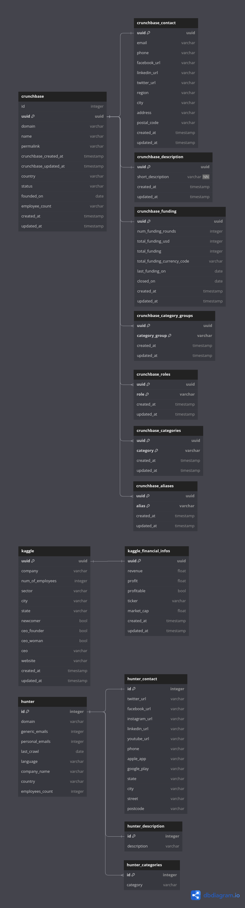

# hunter
Technical assignment for Hunter

## Database design

The SQL design of the database was made via [https://dbdiagram.io/d](https://dbdiagram.io/d). It allows to specify via code the architecture, and export it as a PNG/PDF as well as direct sql scripts. These scripts are used directly by the `psql` command line to setup the tables.



## Setup the postgresql local server

To setup the local postgres, I followed this tutorial [prisma.io/setting-up-postgresql](https://www.prisma.io/dataguide/postgresql/setting-up-a-local-postgresql-database#setting-up-postgresql-on-linux).

To create the `sources` database:
```bash
sudo -u postgres psql -c 'create database sources;'
```

Then create a new user, to avoid using sudo all the time afterwards:
```bash
sudo -u postgres createuser -e pierre
```

### Setup tables

```bash
psql -d sources -f sql_scripts/crunchbase.sql
psql -d sources -f sql_scripts/kaggle.sql
psql -d sources -f sql_scripts/hunter.sql
```

## Test the ingester

The scripts could not be finished in time. \\
The main command would be 
```bash
python etl/main.py datasets/ kaggle
```

with the first arg being the path to the directory containing CSV files, and the second one an optional argument if you want to process only one dataset/source.